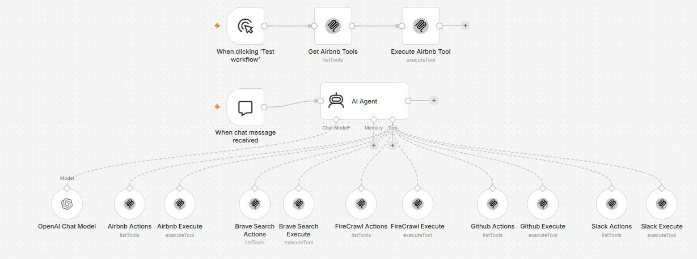

# 🤖 AI MCP Agent using n8n, OpenAI & MCP Servers


---

# 📖 Overview

This workflow demonstrates how to build an intelligent **AI Agent** using **n8n** and the **Model Context Protocol (MCP)**.

Instead of creating separate workflows for each service, the AI Agent acts as a central decision-maker. It receives natural language requests from users, understands the intent using OpenAI, and automatically selects the appropriate MCP tool to complete the requested task.

The workflow integrates multiple MCP-enabled services including Airbnb, Brave Search, Firecrawl, GitHub, and Slack. Depending on the user's request, the agent can search the web, scrape websites, interact with GitHub repositories, communicate through Slack, or retrieve Airbnb-related information.

This architecture showcases how MCP enables AI agents to interact with multiple external tools through a standardized protocol while keeping workflows modular, scalable, and easy to extend.

---
# 🖼️ Workflow Layout



---

# ✨ Features

* 🤖 AI-powered conversational agent
* 🔌 Model Context Protocol (MCP) integration
* 🏡 Airbnb MCP tools
* 🔍 Brave Search integration
* 🌐 Firecrawl website scraping
* 💻 GitHub repository operations
* 💬 Slack messaging support
* 🧠 OpenAI-powered reasoning
* 🔄 Automatic tool selection
* 📚 Tool discovery using MCP
* ⚡ Extensible architecture for adding new MCP servers
* 🎯 Single chat interface for multiple services

---

# 💼 Business Problem Solved

Organizations often rely on multiple platforms for daily operations, such as searching the web, managing source code, collaborating in Slack, scraping websites, or accessing booking information.

Without AI orchestration, users must switch between different applications and APIs, increasing complexity and reducing productivity.

This workflow addresses that challenge by introducing an AI Agent capable of understanding natural language instructions and routing requests to the appropriate MCP tool automatically.

This results in:

* Reduced manual effort
* Unified conversational interface
* Faster task execution
* Improved developer productivity
* Simplified integration of external services

---

# 🛠️ Technologies Used

| Technology                   | Purpose                           |
| ---------------------------- | --------------------------------- |
| n8n                          | Workflow automation platform      |
| OpenAI GPT-4o                | AI reasoning and decision making  |
| MCP (Model Context Protocol) | Standardized tool communication   |
| Airbnb MCP                   | Property search and booking tools |
| Brave Search MCP             | Web search capabilities           |
| Firecrawl MCP                | Website scraping and crawling     |
| GitHub MCP                   | Repository management             |
| Slack MCP                    | Team communication                |
| JSON                         | Structured tool communication     |

---

# 🔧 Prerequisites

Before importing the workflow into n8n, ensure you have:

* Latest version of n8n
* OpenAI API Key
* MCP Server(s) configured
* Brave Search API (if applicable)
* Firecrawl API
* GitHub Personal Access Token
* Slack Bot Token
* Internet access

---

# 🔐 Required Credentials

## 🤖 OpenAI

### Required

* OpenAI API Key

### Used For

* Intent detection
* Tool selection
* Natural language understanding
* AI reasoning

---

## 🔍 Brave Search

### Required

* Brave Search API Key

### Used For

* Internet search
* Real-time information retrieval

---

## 🔥 Firecrawl

### Required

* Firecrawl API Key

### Used For

* Website crawling
* Web scraping
* Structured webpage extraction

---

## 💻 GitHub

### Required

* GitHub Personal Access Token

### Used For

* Repository operations
* Issue management
* Pull request actions
* Repository information

---

## 💬 Slack

### Required

* Slack Bot Token

### Used For

* Send messages
* Read channels
* Team communication

---

## 🏡 Airbnb MCP

### Required

* MCP Server Connection

### Used For

* Property search
* Listing information
* Accommodation-related operations

---

# 🚀 Installation

## 1️⃣ Import Workflow

Import the provided `MCP_Agent.json` into your n8n workspace.

---

## 2️⃣ Configure OpenAI

Create an OpenAI credential using your API key.

Attach the credential to the **OpenAI Chat Model** node.

---

## 3️⃣ Configure MCP Servers

Connect all required MCP servers.

Examples:

* Airbnb MCP
* Brave Search MCP
* Firecrawl MCP
* GitHub MCP
* Slack MCP

---

## 4️⃣ Configure Individual Credentials

Provide credentials for:

* GitHub
* Slack
* Firecrawl
* Brave Search

according to your environment.

---

## 5️⃣ Test Individual MCP Servers

Before enabling the AI Agent, verify each MCP server independently to ensure successful communication.

---

## 6️⃣ Activate the Workflow

Once all credentials are configured and tested successfully, activate the workflow.

The AI Agent will now be ready to process natural language requests and automatically invoke the appropriate MCP tool.

---

# ⚡ Workflow Execution

When a user submits a request through the chat interface, the AI Agent analyzes the prompt using the OpenAI Chat Model.

Based on the detected intent, the agent dynamically selects the appropriate MCP tool. The selected tool executes the requested action and returns the result back to the AI Agent, which then formats a natural language response for the user.

This intelligent routing mechanism enables a single conversational interface to interact seamlessly with multiple external services without requiring users to understand the underlying APIs or workflows.

---

Absolutely! Here's **Part 2** of the README for **Workflow 4 – AI MCP Agent using n8n, OpenAI & MCP Servers**, matching the same professional style as your previous repositories.

---

# 📚 Node-by-Node Documentation

This section explains every node in the workflow, including its purpose, configuration, inputs, outputs, and how it contributes to the AI Agent's decision-making process.

---

# 1️⃣ 💬 When Chat Message Received

**Node Type:** Chat Trigger

## 🎯 Purpose

Starts the AI Agent workflow whenever a user sends a message through the n8n Chat interface.

This node acts as the entry point for all conversational requests.

### 📥 Input

Natural language message from the user.

Example:

```text
Search GitHub for the latest n8n workflows.
```

### 📤 Output

The user's message is forwarded to the AI Agent for analysis.

---

# 2️⃣ 🤖 AI Agent

**Node Type:** AI Agent

## 🎯 Purpose

The AI Agent is the central orchestrator of the workflow. It analyzes the user's intent using the OpenAI Chat Model and decides which MCP tool should be used to fulfill the request.

### Responsibilities

* 🧠 Understand user intent
* 🔎 Select the appropriate MCP tool
* 🔄 Route requests dynamically
* 📦 Process tool responses
* 💬 Generate a human-friendly response

### Connected Components

* OpenAI Chat Model
* Airbnb MCP Tools
* Brave Search MCP
* Firecrawl MCP
* GitHub MCP
* Slack MCP

### Example User Requests

```text
Search Airbnb properties in Goa.
```

```text
Scrape the latest AI news from OpenAI's website.
```

```text
Send a Slack message to the #general channel.
```

```text
List my GitHub repositories.
```

---

# 3️⃣ 🧠 OpenAI Chat Model

**Node Type:** OpenAI Chat Model

## 🎯 Purpose

Provides reasoning and natural language understanding for the AI Agent.

### Configuration

| Parameter   | Value             |
| ----------- | ----------------- |
| Model       | GPT-4o            |
| Temperature | 0.2 (recommended) |
| Max Tokens  | Configurable      |

### Responsibilities

* Intent classification
* Tool selection
* Response generation
* Context understanding

---

# 4️⃣ 🏡 Airbnb Actions (List Tools)

**Node Type:** MCP List Tools

## 🎯 Purpose

Discovers all available Airbnb MCP tools.

### Example Available Tools

* Search Listings
* Property Details
* Host Information
* Availability Lookup

### Output

Returns the list of Airbnb tools that the AI Agent can use.

---

# 5️⃣ 🏡 Airbnb Execute

**Node Type:** MCP Execute Tool

## 🎯 Purpose

Executes the Airbnb tool selected by the AI Agent.

### Example Request

```text
Find 2-bedroom apartments in Goa under ₹5000 per night.
```

### Example Output

```json
{
  "location": "Goa",
  "property_type": "Apartment",
  "price": "₹4500/night"
}
```

---

# 6️⃣ 🔍 Brave Search Actions

**Node Type:** MCP List Tools

## 🎯 Purpose

Retrieves all available Brave Search capabilities.

### Supported Operations

* Web Search
* News Search
* Local Search
* Knowledge Search

---

# 7️⃣ 🔍 Brave Search Execute

**Node Type:** MCP Execute Tool

## 🎯 Purpose

Performs live internet searches through Brave Search.

### Example Prompt

```text
Latest AI automation tools in 2026
```

### Output

Search results with titles, URLs, and summaries.

---

# 8️⃣ 🌐 Firecrawl Actions

**Node Type:** MCP List Tools

## 🎯 Purpose

Lists all available Firecrawl capabilities.

### Available Tools

* Crawl Website
* Extract Content
* Convert Website to Markdown
* Structured Data Extraction

---

# 9️⃣ 🌐 Firecrawl Execute

**Node Type:** MCP Execute Tool

## 🎯 Purpose

Scrapes website content using Firecrawl.

### Example Request

```text
Extract all headings from https://example.com
```

### Output

Structured webpage content.

---

# 🔟 💻 GitHub Actions

**Node Type:** MCP List Tools

## 🎯 Purpose

Lists all GitHub operations available through MCP.

### Examples

* List Repositories
* Get Repository
* Create Issue
* Read Pull Requests
* Search Code

---

# 1️⃣1️⃣ 💻 GitHub Execute

**Node Type:** MCP Execute Tool

## 🎯 Purpose

Executes GitHub operations selected by the AI Agent.

### Example Request

```text
Show my latest repositories.
```

### Example Output

```json
{
  "repository": "n8n-ai-mcp-agent",
  "stars": 42
}
```

---

# 1️⃣2️⃣ 💬 Slack Actions

**Node Type:** MCP List Tools

## 🎯 Purpose

Retrieves Slack operations available to the AI Agent.

### Examples

* Send Message
* Read Channels
* List Users
* Create Channel

---

# 1️⃣3️⃣ 💬 Slack Execute

**Node Type:** MCP Execute Tool

## 🎯 Purpose

Executes Slack operations.

### Example Prompt

```text
Send "Deployment completed successfully." to #general
```

### Example Output

```json
{
  "channel": "#general",
  "status": "Message Sent"
}
```
---

# 🌍 Use Cases

### 💻 Developer Productivity

Use natural language to interact with GitHub repositories, issues, and pull requests.

### 🔍 AI-Powered Research

Search the web with Brave Search and summarize results using AI.

### 🌐 Website Content Extraction

Scrape webpages and convert them into structured content with Firecrawl.

### 💬 Team Collaboration

Send Slack notifications and automate communication workflows.

### 🏡 Travel Assistance

Search Airbnb listings and retrieve accommodation details conversationally.

### 🤖 Unified AI Workspace

Manage multiple services from a single AI-powered interface.

---

# 🎯 Benefits

* 🧠 AI-driven tool selection
* 🔄 Unified conversational interface
* ⚡ Faster workflow automation
* 🔌 Easily extensible with additional MCP servers
* 🛠️ Modular architecture
* 📈 Improved productivity across multiple services

---

# 🛠️ Customization Ideas

* ➕ Add Google Drive MCP integration
* 📅 Integrate Google Calendar MCP
* 📝 Connect Notion MCP
* 🎫 Add Jira MCP support
* 🛒 Connect Shopify MCP
* ☁️ Integrate AWS MCP services
* 📊 Add analytics dashboards
* 🔐 Implement user authentication and permissions

---

# ⚠️ Troubleshooting

| Problem                        | Cause                            | Solution                              |
| ------------------------------ | -------------------------------- | ------------------------------------- |
| AI Agent doesn't select a tool | Missing or unclear prompt        | Provide more specific instructions    |
| MCP server unavailable         | Server offline                   | Verify MCP server configuration       |
| OpenAI authentication failed   | Invalid API key                  | Update OpenAI credentials             |
| GitHub actions fail            | Expired Personal Access Token    | Generate a new token                  |
| Slack messages not sent        | Invalid Bot Token or permissions | Verify Slack app scopes               |
| Firecrawl returns no data      | Invalid URL or API issue         | Check URL format and Firecrawl status |

---

# 🚀 Future Improvements

* 🌍 Multi-agent collaboration
* 🧠 Long-term conversation memory
* 🔒 Role-based access control
* 📊 Usage analytics dashboard
* 🗣️ Voice-enabled interactions
* 🖼️ Image understanding with multimodal models
* 📅 Calendar and email MCP integrations
* ⚡ Automatic discovery of new MCP servers

---

# 🤝 Contributing

Contributions, suggestions, and improvements are welcome. Feel free to fork this repository, open issues, or submit pull requests.

---

# ⭐ Support

If you found this workflow useful, consider giving the repository a **⭐ Star** on GitHub. It helps others discover the project and supports future workflow development.
